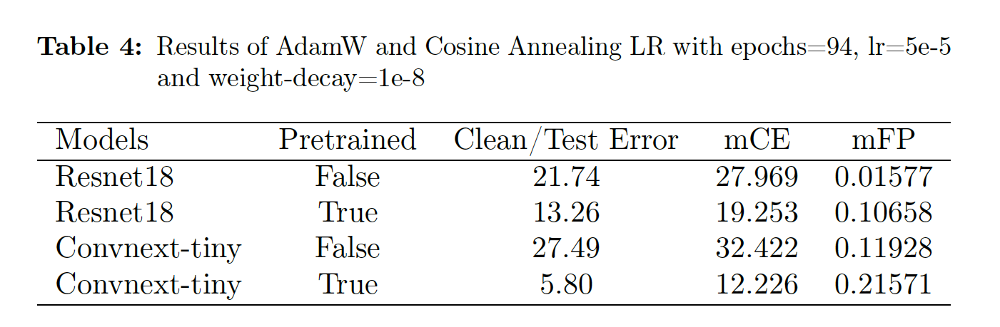

# Title

"Performance evaluation of Resnet18 & ConvNeXt_tiny on OOD (Out of Distribution) Robustness using AugMix"

## Objectives

The main tasks assigned for this study are:
1. The addition of neural networks "Resnet18 and ConvNeXt-tiny" to the
augmix code (not-pretrained and pre-trained).
2. Training of both neural networks on CIFAR-10 and Evaluation on CIFAR-
10, CIFAR-10-C, and CIFAR-10-P datasets with:
(a) AdamW optimizer and cosine annealing learning rate scheduler.
(b) SGD optimizer and lambda learning rate scheduler.
3. Hyperparameter tuning of convnext-tiny model to improve it’s performance

For more details please see [ICLR 2020 paper](https://arxiv.org/pdf/1912.02781.pdf) and the attached report in this repository "Bhardwaj-Suraj-1531066.pdf".

## Requirements
*   numpy>=1.15.0
*   Pillow>=6.1.0
*   torch>=1.2.0
*   torchvision==0.14.0

## Usage

Training recipes used in this study:

WRN: `python cifar.py`

Resnet18(pretrained): `python cifar.py -m resnet18 -pt -op AdamW -sc CosineAnnealingLR`

Resnet18(not-pretrained): `python cifar.py -m resnet18 -op AdamW -sc CosineAnnealingLR`

ConvNeXt_tiny(pretrained): `python cifar.py -m convnext_tiny -pt -op AdamW -sc CosineAnnealingLR`

ConvNeXt_tiny(not-pretrained): `python cifar.py -m convnext_tiny -op AdamW -sc CosineAnnealingLR`

For more details regarding usage you can refer to run-jobscript.sh file.

## Results

## Conclusion

The Resnet18 (not-pretrained) model trained on CIFAR-10 and optimized using SGD and Lambda learning rate scheduler performed best on the CIFAR-10 and
CIFAR-10-C datasets, with a clean error of 11.15 and mCE of 16.837, respectively. When trained using AdamW optimizer and CosineAnnealingLR Scheduler
with hyperparameter values of learning rate=0.001, weight decay=0.0001, and epochs=100, Resnet18(pretrained) model outperforms these results with a Test error of 11.06 and mCE of 16.705. This leads to the conclusion that when properly tuned, the AdamW optimizer in conjunction with the CosineAnnealingLR scheduler outperforms the Stochastic Gradient Descent optimizer in conjunction with the LambdaLR scheduler. However, the trade-off between corruption and perturbation errors is still there and is evident from the outputs of mean Flip Probability values. Irrespective of the methods of model optimization used in this study, the mean Flip probability value is the same for all model comparisons when compared as Resnet18 (SGD) v/s Resnet18(AdamW). It leads to the conclusion that optimization techniques do not affect perturbations, but this is not true for corruptions as illustrated in Figure 3.

Furthermore, the ConvNeXt-tiny model (with pretrained weights) outperforms other models only on Clean and mean Corruption errors. For the mean Flip probability, the results show that a model’s performance on mean Corruption error is poorer than its performance on mean Flip probability, indicating a trade-off between mean corruption error and mean-flip probability. On the ConvNeXt tiny model with pretrained weights, a separate experiment was run with the final settings of experiment 2, except for a larger batch size of 256. This experiment produced relatively good results in a shorter amount of time, with clean error = 5.94 and mean-Corruption error = 12.324. This shows a trade off between efficiency of the model and compute time.
